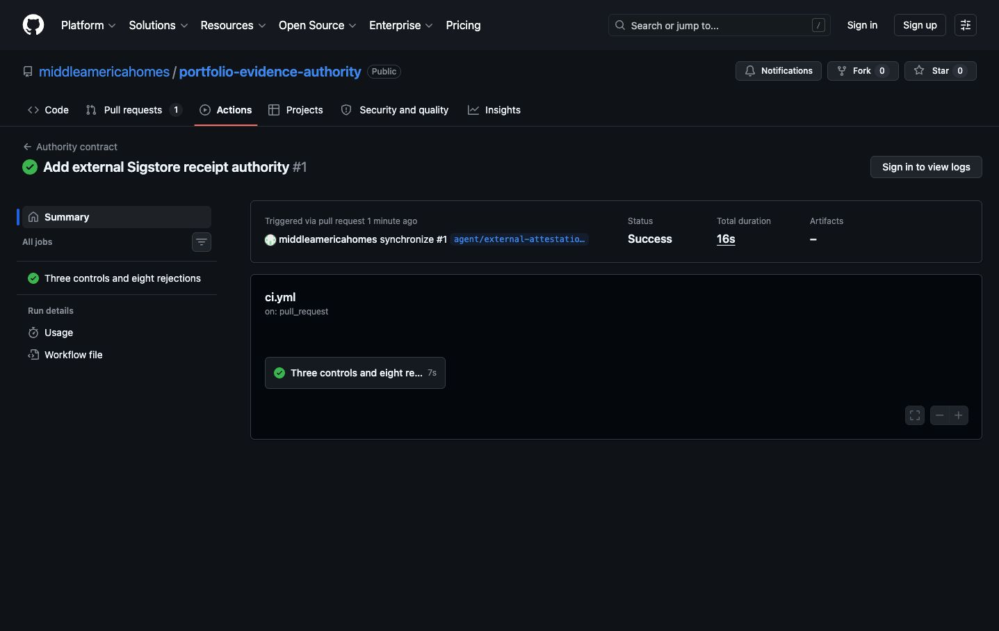

# Receipts now have an independent signature

Portfolio evidence can now prove that a receipt came through a separate signing authority,
not merely from files stored beside the runner it is meant to authenticate.

The new authority accepts only a receipt class, exact filename, and SHA-256 digest. GitHub
Actions validates that closed contract, then GitHub's OIDC and Sigstore service attest the
digest. No private key or evidence payload is stored here.

_The authority's contract tests cover all supported receipt classes plus malformed digest,
path traversal, filename confusion, ceremony confusion, and extension confusion._

Operators verify each receipt against the exact repository, workflow, immutable tag, signer
commit, GitHub OIDC issuer, and GitHub-hosted runner. The downloaded Sigstore bundle and trusted
root are retained with the receipt so verification remains durable offline.
